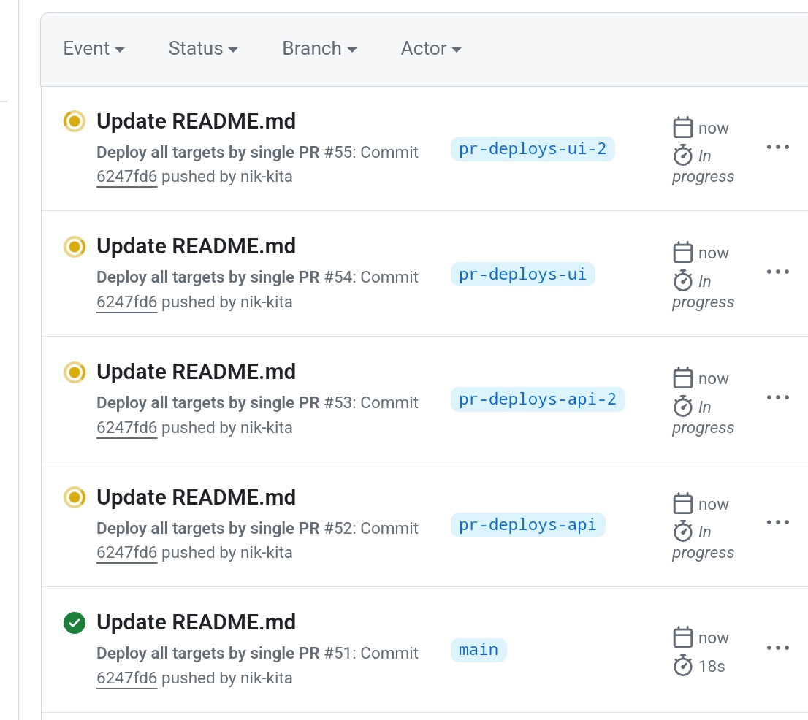

## _[see .github/worflows/deploy.yml](./.github/workflows/deploy.yml)_
## _[see illustration](#how-will-looked-your-actions-after-pr-into-main-branch-only)_

# 1 explicit PR => many implicit deploys
(should be actual for monorepos with multiple microservices)

## This example is use `deno-deploy`:
* work on `dev` or `feature/*` etc. branch
* make pull-request into `main` branch
* all deploys will be triggered automatically:

## Applications deployed from this repo after PR into main:
* ### [pr-deploys-ui.deno.dev](https://pr-deploys-ui.deno.dev)
* ### [pr-deploys-ui-2.deno.dev](https://pr-deploys-ui-2.deno.dev)
* ### [pr-deploys-api.deno.dev](https://pr-deploys-api.deno.dev)
* ### [pr-deploys-api-2.deno.dev](https://pr-deploys-api-2.deno.dev)

#### Tips/notes/logs...

* Prepare repository with __personal__ github token
* Add it into repository's secrets
* Declare branches that will associated with deploys _(1 branch - 1 deno-deploy target)_
* Configure workflow to trigger on their `push`, `pull requests` etc.
* Add conditional logic to filter only own workflow and skip other
* // to be continued... _(maybe)_

## How will looked your actions after pr into main branch only

